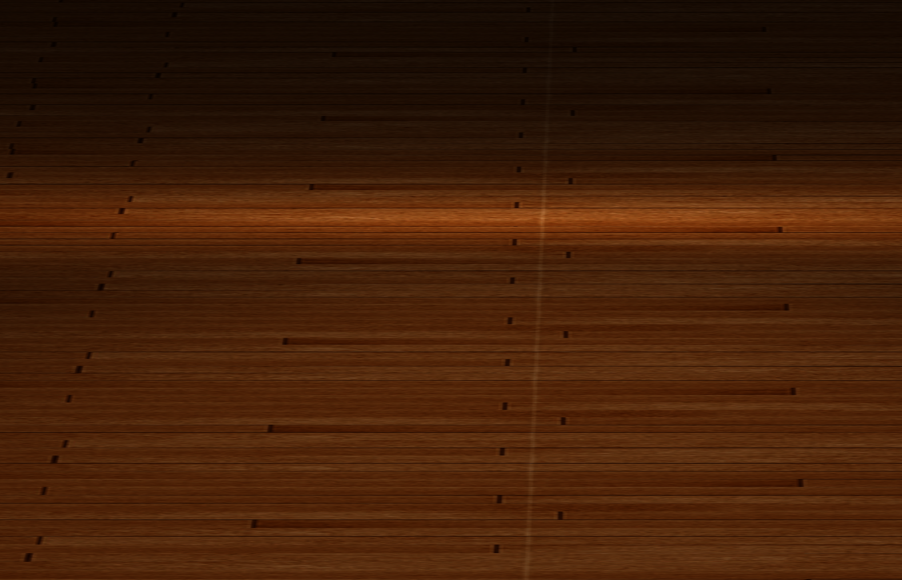

## LearnOpenGL

Implement some graphics techniques using OpenGL following the tutorial [LearnOpenGL](learnopengl.com)

### 1 Light
I implement Gouraud, Phong and Blinn-Phong light models.
Below are some demos.

Below is Phong and Blinn Phong in the same scene.

  
  

The left is Blinn Phong and the the right is Phong.
