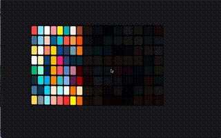

## LearnOpenGL

Implement some graphics techniques using OpenGL following the tutorial [LearnOpenGL](learnopengl.com)

### 1 Light
I implement Gouraud, Phong and Blinn-Phong light models.
Below are some demos.

Below is Phong and Blinn Phong in the same scene.

|         | Lambert | Phong                                 | Blinn Phong                                |
| ------- | ------- | ------------------------------------- | ------------------------------------------ |
| Picture |         |  |  |

The left is Blinn Phong and the the right is Phong.
