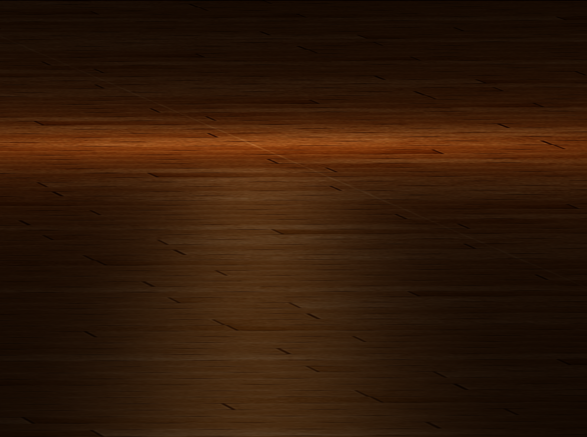

## LearnOpenGL

Implement some graphics techniques using OpenGL following the tutorial [LearnOpenGL](learnopengl.com)

### 1 Light
I implement Gouraud, Phong and Blinn-Phong light models.
Below are some demos.

Below is Phong and Blinn Phong in the same scene.

|         | Lambert                                                      | Phong                                                        | Blinn Phong                                                  |
| ------- | ------------------------------------------------------------ | ------------------------------------------------------------ | ------------------------------------------------------------ |
| Picture |  |  |  |

### 2 Model Loading
As to walk through the whole model loading pipeline, I tried to use a different and more light-weighted model loading library [tinyobjloader](https://github.com/tinyobjloader/tinyobjloader) to load models.
Everytime I follow the LearnOpenGL tutorial using assimp to load models, I didn't figure out what happend and just ctrl-c/v. 
So this time I will do it step by step.
